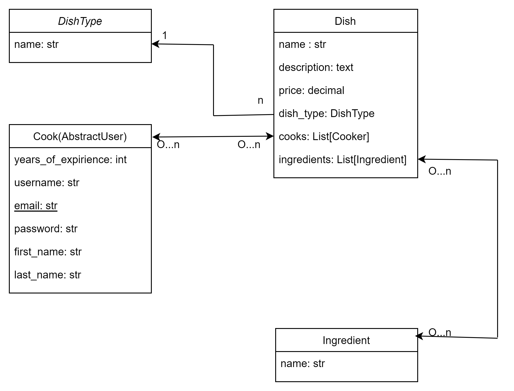
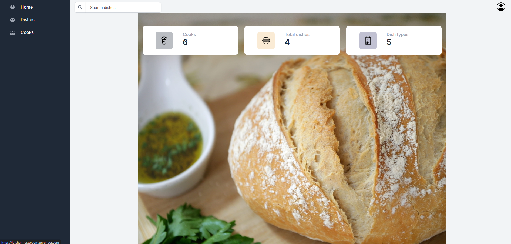

# kitchen-restaurant" 
Kitchen-restaurant - is a program that helps cookers manage their dishes. It allows you to create a dish,
choose incidences, dish type, set price. 

## Check it out!

Kitchen-restaurant project deployed to render
https://kitchen-restoraunt.onrender.com/

For login use following login and password:
* Login: `petro`
* Password: `1111`


## Installation instructions

For beginning you have to install Python3+.

In terminal write down following command:
```shell
git clone https://github.com/VolodymyrSemchysyn/kitchen-restoraunt.git
python -m venv venv
source venv/bin/activate  # for Windows use: venv\scripts\activate
pip install -r requirements.txt
python manage.py migrate
python manage.py collectstatic
python manage.py runserver
```

## Database Structure



## Home page

